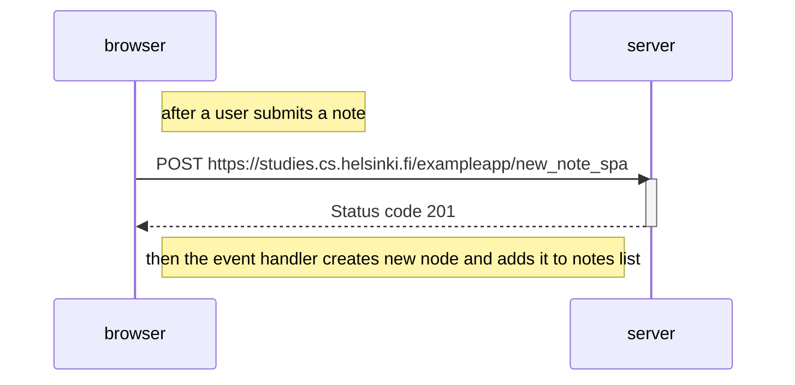

```mermaid
   sequenceDiagram
    participant browser
    participant server

    Note right of browser: after a user submits a note
    browser->>server: POST https://studies.cs.helsinki.fi/exampleapp/new_note_spa
    activate server
    server-->>browser: Status code 201
    deactivate server

    Note right of browser: then the event handler creates new node and adds it to notes list

```
